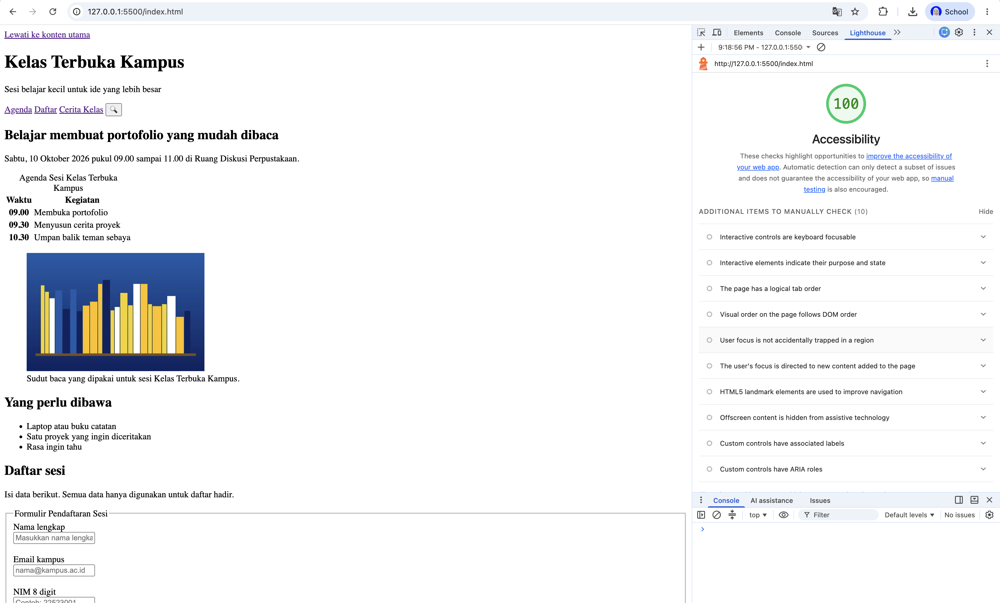
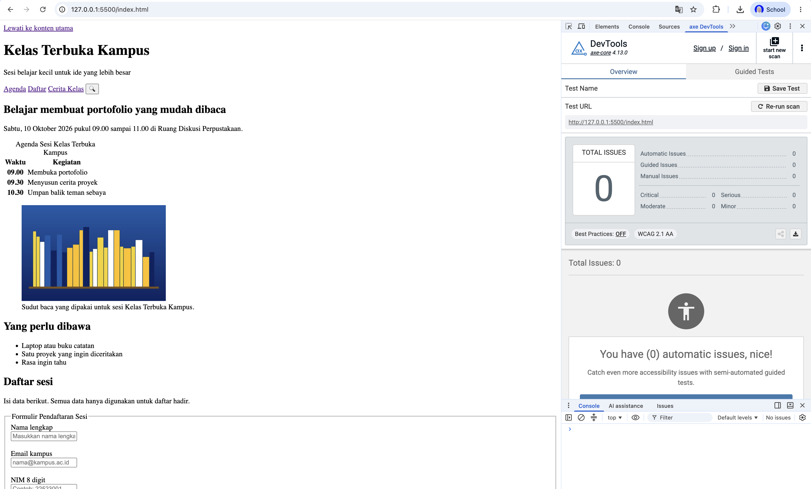

# Praktikum P03 Kelas Terbuka Kampus

Starter yang dipakai untuk praktikum ini adalah `index.html`.

## Anggota tim dan pembagian tugas

- Nama dan NIM anggota 1: Assyifa Nur Fauziyah Jaelani | 25523200
- Nama dan NIM anggota 2: Najla Mufidah | 25523235
- Pembagian tugas anggota 1: Langkah 1, 2, 6
- Pembagian tugas anggota 2: Langkah 4, 5, 6 
(Pembagian tugas ini hanya untuk tanggung jawab, dalam tahap pengerjaannya tetap bersama-sama semua)

## Berkas yang dikumpulkan

- Nama folder dan berkas ZIP: `P03_25523200_25523235`
- Alamat lokal saat halaman diuji (misalnya `http://127.0.0.1:5500/index.html`): `http://127.0.0.1:5500/index.html`

## Validasi W3C

| Kondisi | Jumlah error | Catatan |
| --- | ---: | --- |
| Sebelum perbaikan | 12 | Terdapat error atribut 'lang' yang hilang, strujtur heading melompat, serta elemen tabel dan gambar yang kurang tepat |
| Setelah perbaikan | 0 | Dokumen valid HTML5 tanpa error setelah perbaikan elemen semantik dan penambahan atribut 'alt'|

## Audit awal

| Alat | Hasil sebelum perbaikan | Temuan utama |
| --- | --- | --- |
| axe DevTools | 6 masalah | Elemen form tidak memiliki `<label>`, tombol navigasi tidak memiliki teks aksesibel, dan atribut `lang` pada `<html>` tidak ada |
| Lighthouse Accessibility | Skor: 75 | Halaman belum memiliki atribut bahasa, tombol cari tanpa aria-label, dan label form tidak terhubung eksplisit |

## Tiga temuan audit yang diperbaiki

| No. | Sumber temuan | Kondisi awal dan dampak | Perubahan HTML | Hasil verifikasi ulang |
| ---: | --- | --- | --- | --- |
| 1 | W3C / axe DevTools | Dokumen tidak memiliki atribut `lang="id"` pada tag `<html>`, berdampak pembaca layar (screen reader) tidak dapat mendeteksi bahasa halaman dengan benar | Menambahkan atribut `lang="id"` serta `<meta charset="UTF-8">`, `<meta name="viewport">`, dan `<meta name="description">` pada `<head>` | Lulus validasi W3C Nu Checker & axe DevTools |
| 2 | W3C Nu Checker | Hirarki heading melompat & gak berurutan (`<h2>` dipakai sebagai judul utama lalu melompat ke `<h4>`) | Mengubah judul utama menjadi `<h1>` dan menyesuaikan seluruh judul sub-bagian menggunakan `<h2>`| Lulus validasi W3C Nu Checker tanpa warning |
| 3 | axe DevTools | Kolom input form pendaftaran tidak memiliki `<label>` terikat, menyulitkan pengguna pembaca layar mengetahui fungsi kolom input | Membungkus input dengan `<label for="...">` yang terhubung ke `id` input, serta mengelompokkannya menggunakan `<fieldset>` dan `<legend>` | Lulus pengujian aksesibilitas axe DevTools |

## Uji form

| Skenario | Hasil yang diamati |
| --- | --- |
| Submit kosong | Browser menolak pengiriman dan menampilkan tooltip peringatan bawaan pada kolom Nama Lengkap karena atribut `required` |
| Email tidak valid | Browser menolak pengiriman dan meminta memasukkan format alamat email yang valid (harus menggunakan `@`) |
| NIM bukan 8 digit | Browser menolak pengiriman jika input kurang dari 8 digit angka karena adanya aturan `pattern="[0-9]{8}"` dan `maxlength="8"` |
| Klik teks label | Kursor/fokus secara otomatis aktif dan berpindah langsung ke dalam kolom input yang terhubung |

## Uji keyboard only

Jelaskan urutan fokus saat menggunakan Tab dan Shift+Tab serta hasil aktivasi kontrol dengan Enter atau Space.

Urutan fokus navigasi keyboard menggunakan tombol `Tab` bergerak secara logis sesuai struktur DOM:
1. Tautan Lewati ke konten utama (skip link).
2. Tautan navigasi header (Agenda, Daftar, Cerita Kelas).
3. Tombol pencarian (Cari kegiatan).
4. Isian formulir pendaftaran (Nama lengkap, Email kampus, NIM, Topik, lalu tombol Kirim).
5. Pemutar video di bagian cerita kelas.

Navigasi mundur menggunakan `Shift + Tab` bekerja sesuai urutan kebalikannya. Menekan tombol `Enter` pada skip link berhasil memindahkan fokus langsung ke landmark `<main id="isi-utama">`. Tombol pencarian, formulir, serta kontrol pemutar video dapat diaktifkan menggunakan `Enter` atau `Space`.

## Audit Lighthouse

- Skor Accessibility awal: 71
- Skor Accessibility terakhir: 100
- Tanggal audit: 21 September 2026
- Tangkapan layar skor Lighthouse:

Simpan tangkapan layar di folder `bukti/` dan tempel di bawah bagian ini, misalnya ``.

## Catatan evaluasi WCAG kontras

Tuliskan alat yang digunakan dan hasil pemeriksaan kontras sebagai bukti pemahaman WCAG. Tidak ada perubahan warna atau CSS yang dikerjakan pada praktikum ini.

Pemeriksaan kontras dievaluasi menggunakan alat axe DevTools dan Chrome DevTools untuk memastikan kesesuaiian dengan prinsip WCAG 2.1. Karena praktikum ini murni fokus pada struktur HTML semantik tanpa menerapkan CSS khusus, rasio kontras memanfaatkan warna default dari browser (teks hitam di atas latar belakang putih). Tampilan bawaan template ini memberi rasio kontras yang sangat tinggi dan telah memenuhi kriteria tingkat aksesibilitas WCAG.